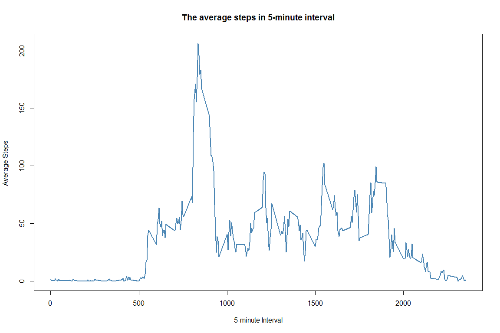
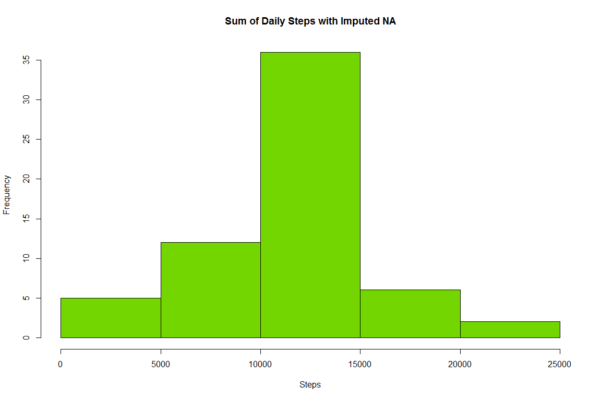

#Reproducible Research:Assigment 1
##Title : Reproducible Research
##Author : Maynila Voravongseng
##Date : March 6, 2018
##output: html_document

#####This assignment will be described in multiple parts. You will need to write a report that answers the questions detailed below. Ultimately, you will need to complete the entire assignment in a single R markdown document that can be processed by knitr and be transformed into an HTML file.

#####Throughout your report make sure you always include the code that you used to generate the output you present. When writing code chunks in the R markdown document, always use echo = TRUE so that someone else will be able to read the code. This assignment will be evaluated via peer assessment so it is essential that your peer evaluators be able to review the code for your analysis.

#####For the plotting aspects of this assignment, feel free to use any plotting system in R (i.e., base, lattice, ggplot2)

#####Fork/clone the GitHub repository created for this assignment. You will submit this assignment by pushing your completed files into your forked repository on GitHub. The assignment submission will consist of the URL to your GitHub repository and the SHA-1 commit ID for your repository state.

#####NOTE: The GitHub repository also contains the dataset for the assignment so you do not have to download the data separately.


##Using Library

```r
library(dplyr)
library(ggplot2)
library(lubridate)
```

## 1. Load the data provided Dataset: Activity monitoring data[52k] using read.csv


```r
act1 <- read.csv("activity.csv", header = TRUE)
```


#### Calculate the total number of taken per day. Using na.Omit() to clean na data. Using group_by(day) then calculate sum steps per day


```r
act_day <- na.omit(act1) %>%
           group_by(date) %>%
           summarise(steps = sum(steps)) %>%
           select(date, steps)
```


## 2. Using simple Histogram to plot histogram of the total number of steps taken each day


```r
hist(act_day$steps, col = '#8b9dc3', main = "Total of steps taken each day", 
     xlab ="Total steps per day")
```

<!-- -->


## 3 The Mean number of steps taken each day

```r
actMean<-mean(act_day$steps)
actMean
```

```
## [1] 10766.19
```

## 3 The median number of steps taken each day

```r
actMedian<-median(act_day$steps)
actMedian
```

```
## [1] 10765
```


## 4. Time series plot of the average number of steps taken
## 

```r
act_ave <- na.omit(act1) %>%
           group_by(interval) %>%
           summarise(steps = mean(steps)) 
```


```r
plot( act_ave$interval,act_ave$steps, type = "l", lwd = 2, col = '#4b86b4', 
      ylab = "Average Steps ", xlab= "5-minute Interval", 
      main = "The average steps in 5-minute interval")
```

<!-- -->
### 5. The 5-minute interval that, on average, contains the maximum number of steps


```r
act_ave[which.max(act_ave$steps),]$interval
```

```
## [1] 835
```
## 6. Code to describe and show a strategy for imputing missing data


## Calculate and report the total number of missing values in the dataset using nrow()rows. 


```r
act_Na <- act1[act1$steps == "NA",]
nrow(act_Na)
```

```
## [1] 2304
```


### Filling in all of the missing values in the dataset. Using the mean for that 5-minute interval. 
#### 1. group by function to calculate the mean by interval.  
#### 2. mutate() function to add new columns (dailymean).
#### 3. using ifelse () to replace na with mean of steps by 5min interval. 


```r
actna <- act1 %>%
           group_by(interval) %>%
           mutate(dailymean = mean(steps,na.rm = TRUE))
          
actna$steps <-ifelse(is.na(actna$steps), actna$dailymean, actna$steps)
```
#### save a copy of actna to new dataset act_week

```r
act_week <-actna
```

## Calculate the sum of steps taken by day using actna dataset

```r
actna <- actna %>%
           group_by(date) %>%
           summarise(steps = sum(steps)) %>%
           select(date, steps)
```

## 7. Histogram of the total number of steps taken each day after missing values are imputed

```r
hist(actna$steps, col = '#74d600', main = 'Sum of Daily Steps with Imputed NA', xlab = "Steps")
```

<!-- -->


##the mean total number of steps taken per day with NA fill in

```r
actnaMean<-mean(actna$steps)
actnaMean
```

```
## [1] 10766.19
```

##The median total number of steps taken per day with NA fill in


```r
actnaMedian<-median(actna$steps)
actnaMedian
```

```
## [1] 10766.19
```
###Do these values differ from the estimates from the first part of the assignment? 
What is the impact of imputing missing data on the estimates of the total daily number of steps?

#### When I overlayed histogram plot of sum of daily steps with NA remove to the histogram sum of daily steps with NA fill in with Average of interval steps two histogram

#### The shape of both histograms is the same.
#### The NA filling in histogram plot is higher.
#### There is no different in daily mean total number of steps.
#### There is a small different in median value.


```r
hist(actna$steps, col='#74d600',main = 'Overlapping Histogram', xlab = "")
hist(act_day$steps, col='#8b9dc3', add=T)
box()
```

<!-- -->

###Are there differences in activity patterns between weekdays and weekends?
### 
### Create a new factor variable in the dataset with two levels - "weekday" and "weekend" indicating whether a given date is a weekday or weekend day.


```r
act_week$date <-weekdays(as.Date(actna$date))
```

```r
weekday <- c('Monday', 'Tuesday', 'Wednesday', 'Thursday', 'Friday')
act_week$week <- factor(ifelse(act_week$date %in% weekday,"weekday","weekend"))
```

### Split the dataset to two: weekday and weekend

```r
weeksplit <-split(act_week, act_week$week)
```

```r
act_weekday <- weeksplit$weekday %>%
           group_by(interval) %>%
           summarise(steps = mean(steps)) 
          
act_weekend <- weeksplit$weekend %>%
           group_by(interval) %>%
           summarise(steps = mean(steps)) 
```


```r
plot( act_weekday$interval,act_weekday$steps, type = "l", lwd = 2, main = "Weekday", xlab = "Interval", col = "#5e3c58")  
```

<!-- -->

```r
plot( act_weekend$interval,act_weekend$steps, type = "l", lwd = 2, main = "Weekend", xlab ="Interval", ylab ="Steps", col = "#5e3c58")
```

<!-- -->


